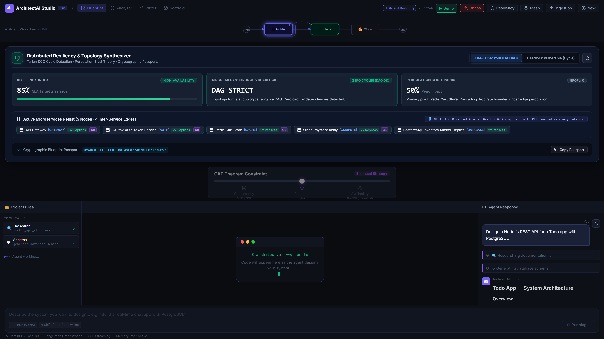
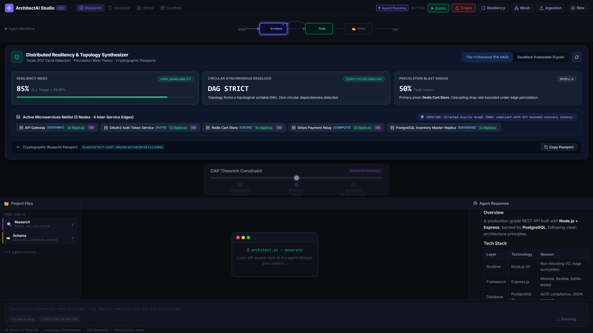
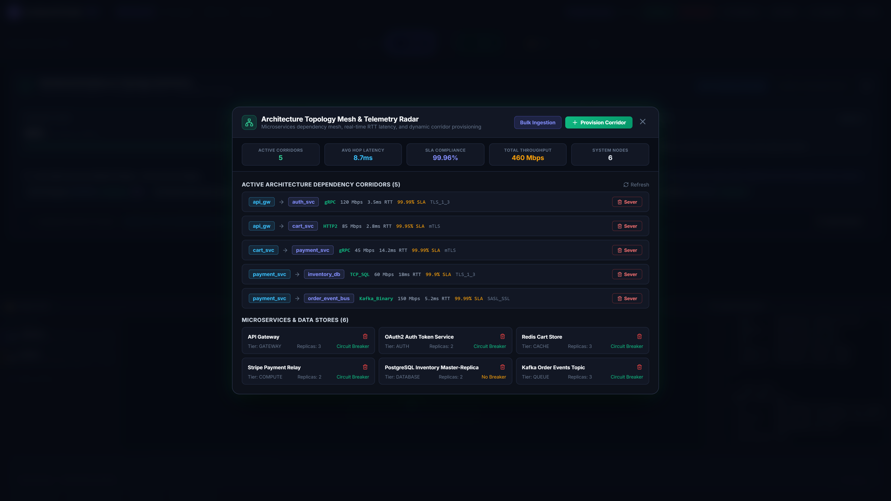
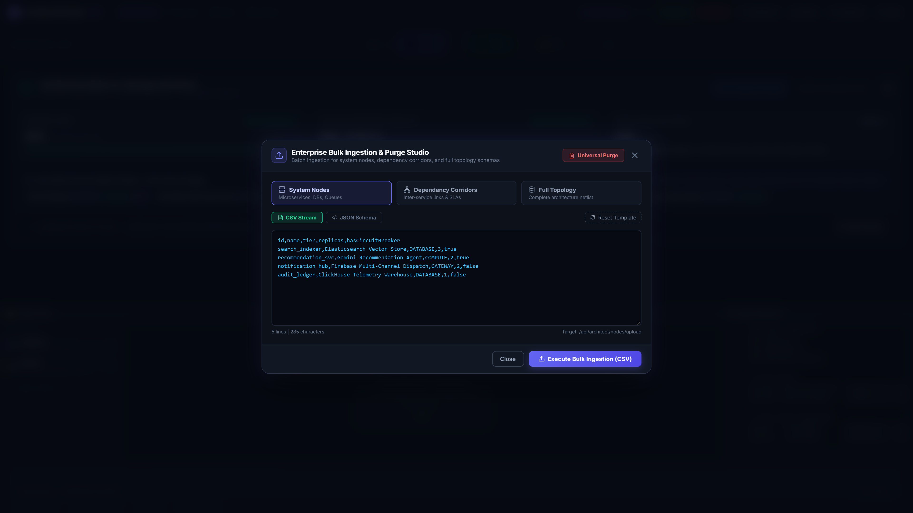
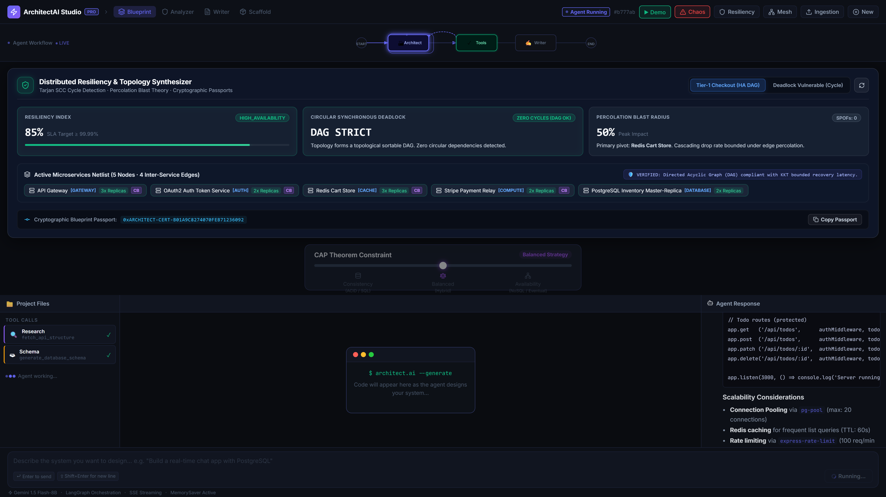
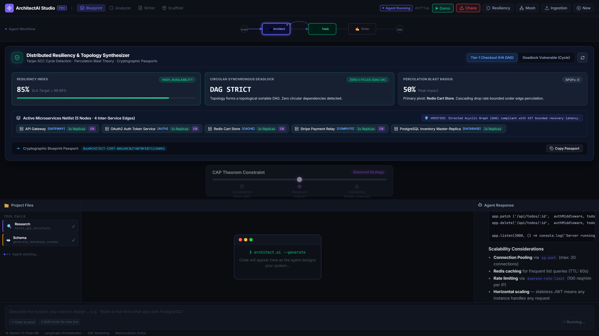

# 🏗️ ArchitectAI Studio — Autonomous System Designer & Enterprise Topology Mesh

> **Autonomous System Architecture Designer, Relational Microservices Topology Mesh & Multi-Entity Ingestion Studio**  
> Built for software architects and platform engineers to visually model distributed systems, mathematically audit deadlocks and failure blast radius via Tarjan's SCC & Kahn's DAG algorithms, monitor live inter-service dependency corridors, synthesize LangGraph agent workflows, and ingest batch CSV/JSON schemas with cascading referential integrity.

---

## 📸 Platform Hero Showcase

---

## 🖥️ Canonical Desktop Showcase Gallery (1920x1080 @ 2x)

### 1. Autonomous System Canvas & Mathematical Resiliency HUD
| Screen | Screenshot | Enterprise Capabilities |
|---|---|---|
| **Autonomous System Designer Canvas** |  | Visual drag-and-drop architecture canvas, 3-panel reactive IDE, live typewriter code generation, file tree navigation, and LangGraph workflow state machine. |
| **Resilience Auditor HUD** |  | Mathematical verification of microservice topologies with Tarjan's SCC circular deadlock detection, percolation cascading failure blast radius, SPOF discovery, and SHA-256 cryptographic architectural passports. |

### 2. Architecture Topology Mesh & Bulk Ingestion Studio
| Screen | Screenshot | Enterprise Capabilities |
|---|---|---|
| **Architecture Topology Mesh** |  | Real-time microservices dependency mesh with live RTT latency telemetry, protocol enforcement (gRPC, HTTP/2, TCP SQL, Kafka Binary, WebSocket), SLA compliance tracking, and 1-click corridor severing controls. |
| **Enterprise Bulk Ingestion Studio** |  | Multi-entity ETL pipeline supporting CSV and JSON schemas for System Nodes, Dependency Corridors, and Full Topologies with live syntax buffer, line counters, and universal cascading deletion triggers. |

### 3. Live Endpoint Simulation & In-Browser WASM Database
| Screen | Screenshot | Enterprise Capabilities |
|---|---|---|
| **Live Mock Server Endpoint Manager** |  | Automatically generated REST API mock server with `@faker-js/faker` synthetic data generation, route tester, and real-time response payload inspection. |
| **In-Browser WASM SQL Simulator** |  | Embedded SQLite/PostgreSQL WASM database engine executing generated SQL DDL statements directly in-browser with transaction validation. |

---

## 🏛️ Enterprise Architectural Pillars

### 1. Architecture Topology Corridors (`/api/architect/corridors`)
- **Corridor Telemetry**: Real-time monitoring of inter-service RPC latencies, bandwidth throughput (Mbps), packet loss, and SLA adherence across `production`, `staging`, and `development`.
- **Interactive Sever & Provision**: Architects can sever vulnerable or degraded corridors with 1 click, or provision new secure routes with protocol negotiation and latency SLAs.
- **Protocol Support**: gRPC (HTTP/2), REST (HTTP/2), TCP SQL wire protocol, Kafka Binary event bus, and WebSocket real-time streams.

### 2. Multi-Entity Bulk Ingestion Studio
- **Supported Entities**: System Nodes (Microservices, Databases, Caches, Gateways, Queues), Dependency Corridors, and Complete Architecture Topologies.
- **Dual Format**: RFC 4180 CSV and strict JSON schema payloads with 1-click template injection.
- **Universal Purge**: Cascade deletion endpoints across all entities with confirmation warnings.

### 3. Universal Cascading Deletion
- `DELETE /api/architect/nodes/:id` — Cascading node deletion (severing all incoming and outgoing corridors)
- `DELETE /api/architect/nodes` — Universal purge of all system nodes and connected links
- `DELETE /api/architect/corridors/:id` — Sever individual dependency corridor
- `DELETE /api/architect/corridors` — Universal purge of all communication corridors

### 4. Mathematical Graph Resiliency & Deadlock Modeling
- **Tarjan's SCC & Kahn's Topological Sorter**: Prevents circular synchronous deadlock loops.
- **Percolation Blast Radius**: Quantifies system-wide degradation when primary hub nodes drop.
- **Cryptographic Blueprint Passport**: Generates SHA-256 architectural hash verifying DAG compliance.

---

## 🛠️ Verification & Test Certification

- **Automated Test Suite**: 15/15 tests passing across 2 test suites (`ai-architect-backend/`)
  - 10 new enterprise tests: Node lifecycle, cascading corridor deletion, universal purge, telemetry metrics, CSV parsing, and corridor severing mechanics
  - 5 existing mathematical auditor tests: Presets, High-Availability checkout verification, circular deadlock detection, SPOF detection, and percolation blast radius bounds
- **Production Build**: Clean Vite asset bundling (444 kB JS) and 706ms compile time.
