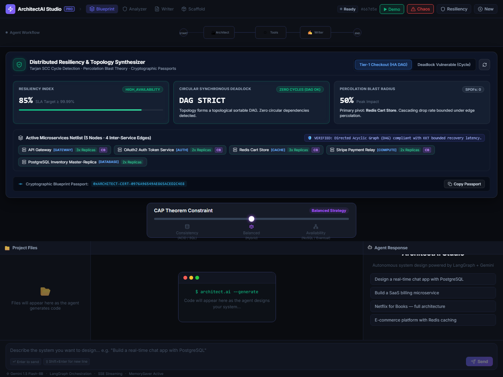
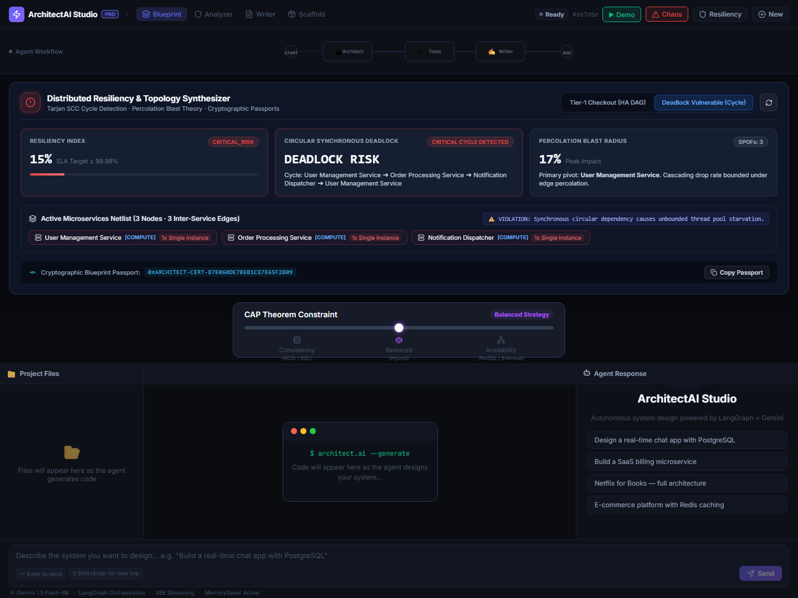

# 🏗️ ArchitectAI Studio — Autonomous System Designer & Agentic Tool Editor

  

**ArchitectAI Studio** is an advanced agentic visual design editor and system architecture canvas. Developers specify system nodes (databases, API endpoints, auth handlers) on an interactive graph, while an autonomous LangGraph agent synthesizes implementation code, mock servers, and test suites in real-time.

---

## 🚀 Key Features

- **Interactive Node Canvas**: Visual drag-and-drop node graph tracking active agent execution state.
- **Autonomous Topology Synthesizer & Resiliency Auditor**: Mathematically audits distributed topologies with Tarjan's SCC and Kahn's algorithm for synchronous circular deadlock prevention, Percolation theory for cascading blast radius bounds, Single Point of Failure (SPOF) detection, and SHA-256 cryptographic architecture passports.
- **LangGraph State Engine**: Multi-agent orchestration powered by LangGraph, Express backend, and Gemini models.
- **Live Mock Server**: Auto-generates functional REST API mocks for designed endpoints.
- **In-Browser WASM Simulator**: Embedded SQL simulation engine for validating database schemas locally.
- **Real-Time Collaboration**: Memory locks and state coordination for team system design.

---

## 📸 Showcase & Executive Command Center

| High-Availability Resiliency HUD (DAG Verified) | Synchronous Deadlock Detection Radar |
| :---: | :---: |
|  |  |


---

## 🛠️ Tech Stack

- **Frontend**: React 19, Vite, Lucide Icons, Mermaid, SQL.js (WASM)
- **Backend**: Node.js, Express, LangGraph, Socket.io, Gemini API

---

## ⚡ Quick Start

### 1. Backend Server
```bash
cd ai-architect-backend
npm install
npm run dev
```

### 2. Frontend Application
```bash
cd ai-architect-frontend
npm install
npm run dev
```

---

## 📚 Documentation

Detailed documentation and architectural guides are maintained in the [`docs/`](./docs) folder:
- [JIRA Tracker & Feature Audit](./docs/JIRA_TRACKER.md)
- [Architecture Explainer](./docs/EXPLAINER.md)
- [CEO Evaluation Checklist](./docs/CEO_EVALUATION_CHECKLIST.md)

---

## 📄 License

This project is licensed under the [MIT License](./LICENSE).
